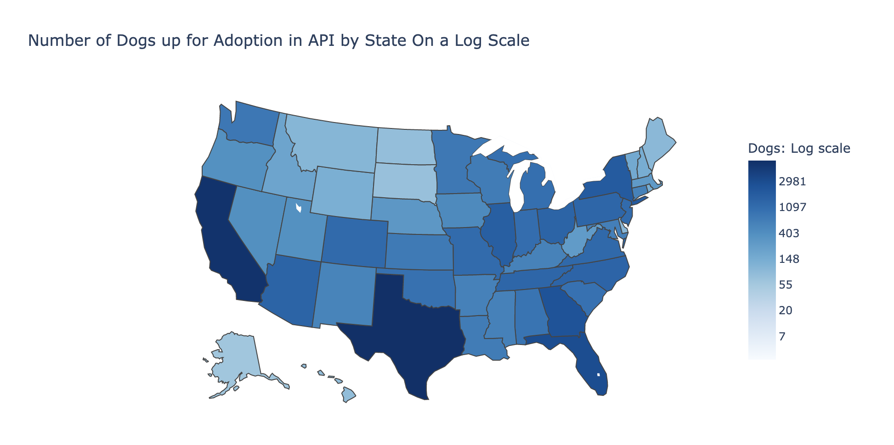

# Sta141b-final
Final project about adoptable dogs and cats in shelters.

## Scrape API for data for adoptable dogs

### Setup
- Import all needed libraries
- Define a function for Bearer Authorization which will be needed later
- Get the token from the API in order to access the API

### Get the Dataframe
- Using a for loop, get the data for first 500 pages of dogs
    + Limit page for 100 results per page
    + Set to get adoptable dogs
    + Sort pets randomly in order to try to get an accurate sample from different states
- Clean up the DataFrame and get preliminary information on it
- Get the head of the DataFrame

## Create a database and insert dog table
- Clear the table before inserting the newly scraped data

## SQL analysis
- Find the total number of female and male dogs
    + The number of males and females seem to be approximatly evenly split, but there is a higher number of adoptable male dogs
- Find the total number of dogs per state
    + There seems to be a bias towards states with larger populations like California and Texas

## Visualizations
- The top three dogs in sheltars are Pit Bulls, Labroador Retrievers, and Mixed Breed Dogs
- The most frequent age of dogs in shelters is adult dogs. There are few senior dogs in shelters
- Medium dogs are the most common size of dog in shelters
- Dogs with short coats are the most common
- Majority of dogs are mixed breed dogs
- The most common primary color of dogs in shelters is black
- The most common secondary color of dogs in shelters is white
- Majority of dogs in shelters are spayed or neutered
- Majority of dogs in shelters are not house trained
- There are very few dogs in shelters with special needs
- Majority of dogs in shelters have current shots
- Majority of dogs in shelters do well in an environment with other dogs and children
- About half the dogs in shelters do well in an environment with cats and the other half do not do well in an environment with children
- There is a map of states with a logaritmic scale of adoptable dogs. Please open up the jupyer notebook on your own machine to take a look at it as it does not load up on github.

## Get all available dog photos
- Make sure none of the urls are broken while downloading dog photos or else you will run into an error

## Scrape API for cat data
- Do the same thing as the dog data but for cats this time

## Insert cat data into database
- Clear the table before inserting the newly scraped data

## SQL Analysis
- Find the total number of male and female cats in shelters
    + There are slightly more male cats than female cats in shelters, but it is very evenly split
- Find the total number of cats per state
    + Again there is a bias towards states with larger populations

## Visualizations
- There is a map of states with a logaritmic scale of adoptable cats. Please open up the jupyer notebook on your own machine to take a look at it as it does not load up on github.
- The most common cat breed in shelters is domastic shorthair
    + They make up the majority of cats in shelters
- There are few senior cats in shelters as the rest are evenly split between being young, adult, or baby
- Majority of cats in shelters are medium sized
- Most cats in shelters have a short coat
- Most cats in shelters are not mixed breed
- The most common primary color of cats in shelters is black
    + There are also many tuxedo cats (majority black and some white) in shelters as they are the second most common color
- The most common secondary color of cats in shelters is white
- Majority of cats in shelters are spayed or neutered
- More than half the cats in shelters are house trained
    + There are also many cats in shelters that are not house trained
- Very few cats are declawed
    + That is a good thing because declawing is a very cruel and inhumane process
- Very few cats in shelters have special needs
- Majority of cats in shelters have their current shots
- Majority of cats can get along in an environment with dogs, other cats, and chidlren

## Get all available cat photos
- Same process as getting all dog photos

## Image Classification 

### Be able to load all images
- If you are unable to load the image, then the file is likely corrupt and the data loader will also be unable to process the image
- If the image does not load, delete the image 

### Imports
- Import tensorflow to build your neural network 

### Preprocessing
- Rescale your data
- Split your data into train and test sets

### Build your model
- Using a sequential model
- Add four convolutional layers with a relu activation function
- Add a flatening layer
- Add another Dense hidden layer with a relu activation function
- Add your output layer with a sigmoid activation function

### Compile your model

### Fit train data to model
- Add early stopping to callback to prevent overfitting
- Add validation data to see how the model is performing on unseen data

### Make image predictions on unseen data
- Build a function that can take in an image and run it through the model to make a prediction on if the image is a dog or a cat
    + Can input any image to this function 

### Validate the test data
- Check how well the model performs on unseen data 
    + Measuring how well the model is doing with accuracy