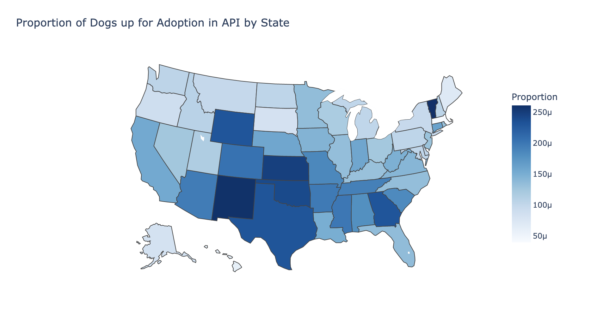
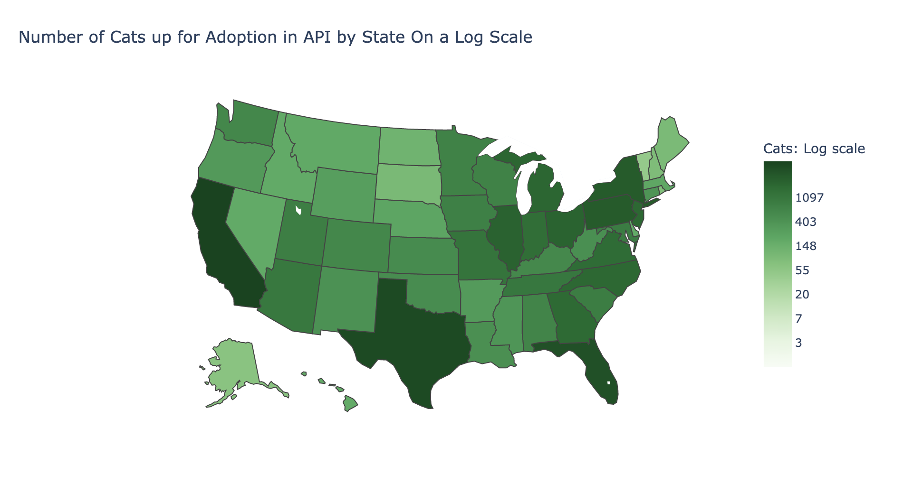
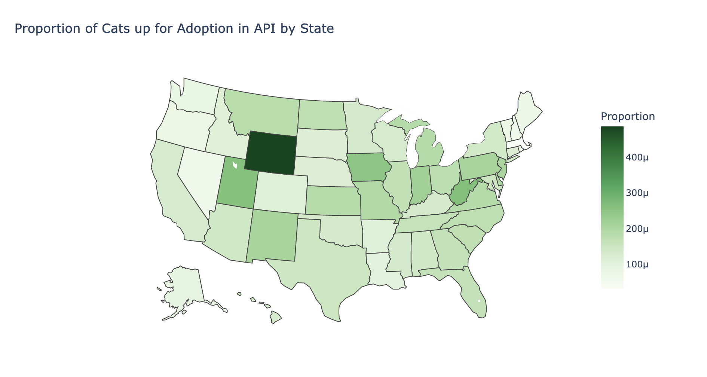

# Sta141b-final: Air Singh, Ilham Tokhi, Jaehyeon Park, James Chapman, Kate Johnson
Final project about adoptable dogs and cats in shelters.

# Grading Aspects
- Project organization, writeup readability, and overall conclusions
    + Project is well organized on github repo
    + Writeup on README explains most cells to reader
    + Conclusions are well documented in README
- Code quality, readability, and efficiency
    + Code is easily readable and is broken up into small cells
    + Use of loops instead of multiple lines of the same code
    + Use of tqdm to let user know how long it will take for the cell to finish running
- Data munging
    + Use of data munging while making visualizations to extract features for the visualizations
- Data visualization
    + Plenty of visualizations for features of data
- Data extraction
    + Use of Petfinder API to extract data
    + Additionaly, use of Bearer token needed to access data

# Dog Data

## Scrape API for data for adoptable dogs

### Setup
- Import all needed libraries
- Define a function for Bearer Authorization which will be needed later
- Get the token from the API in order to access the API

### Get the Dataframe
- Using a for loop, get the data for first 100 pages of dogs
    + Limit page for 500 results per page
    + Set to get adoptable dogs
    + Sort pets randomly in order to try to get an accurate sample from different states
- Clean up the DataFrame and get preliminary information on it
- Get the head of the DataFrame

## Create a database and insert dog table
- Clear the table before inserting the newly scraped data

## SQL analysis
- Find the total number of female and male dogs
    + The number of males and females seem to be approximatly evenly split, but there is a higher number of adoptable male dogs
- Find the total number of dogs per state
    + There seems to be a bias towards states with larger populations like California and Texas

## Visualizations
- The top three dogs in sheltars are Pit Bulls, Labroador Retrievers, and Mixed Breed Dogs
- The most frequent age of dogs in shelters is adult dogs. There are few senior dogs in shelters
- Medium dogs are the most common size of dog in shelters
- Dogs with short coats are the most common
- Majority of dogs are mixed breed dogs
- The most common primary color of dogs in shelters is black
- The most common secondary color of dogs in shelters is white
- Majority of dogs in shelters are spayed or neutered
- Majority of dogs in shelters are not house trained
- There are very few dogs in shelters with special needs
- Majority of dogs in shelters have current shots
- Majority of dogs in shelters do well in an environment with other dogs and children
- About half the dogs in shelters do well in an environment with cats and the other half do not do well in an environment with children
- There is a map of states with a logaritmic scale of adoptable dogs. 

- Get the data of the human population 
- Merge tables
- Plot a regression line of dog adoptions to the human population
    + As the human population increases, so does the number of dog adoptions
- There is a map of states with the proportion of dog adoptions to humans

## Get all available dog photos
- Set up the data directory to include train and test and within those directories, a folder for cats and dogs. Example of what our directory looks like is shown below
    + data
        - Train
            + doggie
            + catto
        - Test
            + doggie_test
            + catto_test
- Data directory was too large to upload to github
- Make sure none of the urls are broken while downloading dog photos or else you will run into an error
    + If the url is broken, append it to the broken url list instead of trying to extract that picture

# Cat Data

## Scrape API for cat data
- Do the same thing as the dog data but for cats this time

## Insert cat data into database
- Clear the table before inserting the newly scraped data

## SQL Analysis
- Find the total number of male and female cats in shelters
    + There are more female cats than male cats in shelters, but it is approximatly evenly split
- Find the total number of cats per state
    + Again there is a bias towards states with larger populations

## Visualizations
- There is a map of states with a logaritmic scale of adoptable cats. 

- Join the cat data with human population data
- Plot a regression line of cat adoptions to the human population
    + As the human population increases, so does the number of cat adoptions
- There is a map of states with the proportion of cat adoptions to the human population

- The most common cat breed in shelters is domastic shorthair
    + They make up the majority of cats in shelters
- There are few senior cats in shelters as the rest are evenly split between being young, adult, or baby
- Majority of cats in shelters are medium sized
- Most cats in shelters have a short coat
- Most cats in shelters are not mixed breed
- The most common primary color of cats in shelters is black
    + There are also many tuxedo cats (majority black and some white) in shelters as they are the second most common color
- The most common secondary color of cats in shelters is white
- Majority of cats in shelters are spayed or neutered
- More than half the cats in shelters are house trained
    + There are also many cats in shelters that are not house trained
- Very few cats are declawed
    + That is a good thing because declawing is a very cruel and inhumane process
- Very few cats in shelters have special needs
- Majority of cats in shelters have their current shots
- Majority of cats can get along in an environment with dogs, other cats, and chidlren

## Get all available cat photos
- Same process as getting all dog photos

# Image Classification 

## Be able to load all images
- If you are unable to load the image, then the file is likely corrupt and the data loader will also be unable to process the image
- If the image does not load, delete the image 

## Imports
- Import tensorflow to build your neural network 

## Preprocessing
- Rescale your data
- Split your data into train and test sets
    + The split was approximatly a ratio of 0.80 in the train set and 0.20 in the test set
    + The split was done manually on our machine, there is no code in the notebook to do this split

## Build your model
- Using a sequential model
- Add four convolutional layers with a relu activation function
- Add a flatening layer
- Add another Dense hidden layer with a relu activation function
- Add your output layer with a sigmoid activation function

## Compile your model

## Fit train data to model
- Add early stopping to callback to prevent overfitting
- Add validation data to see how the model is performing on unseen data

## Make image predictions on unseen data
- Build a function that can take in an image and run it through the model to make a prediction on if the image is a dog or a cat
    + Can input any image to this function 

## Validate the test data
- Check how well the model performs on unseen data 
    + Measuring how well the model is doing with accuracy

# Results and Conclusions
- Using Data technology we are able to investigate and discover information from websites and a variety of API’s. 
- By the exploration of adoptable dogs from the Petfinder API, it is possible to have found some of the characteristics of dogs from the website that are adoptable, like the size, gender, age, and breed, that all have some extent of significance. As described in “Visualizations”, there are notable differences in the dogs in the commonality of the dogs that are put up for adoption
- Distribution of these animals appears more in the south central region of the United states, and in areas with higher population density. Visualizations of the data aid in giving context and suggesting further analysis to take with the variables used. 
- Using image classification and convolutional neural networks provides further extent of our understanding of collecting and using information provided from the web. The model shows how to take images and with high accuracy report what the image is of. 
